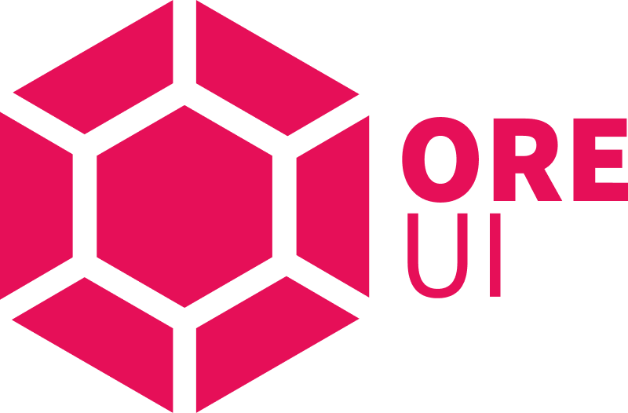

# Ore UI meta-repo

Open-source building blocks from Mojang Studios to construct video game user interfaces (UI's) using [web standards](https://coherent-labs.com/products/coherent-gameface/).

## What is this?

This repository contains some infrastructure bits used internally, but that can also be shared across other game studios and general-purpose web applications.

Current titles using this tech:

- Minecraft Bedrock Edition
- Minecraft Legends

Ore UI is based on:

- [React](https://reactjs.org/)
- [TypeScript](https://www.typescriptlang.org/)

## Packages

- [`@react-facet`](packages/@react-facet): Observable-based state management for performant game UIs built in React
- `@mojang/react-gamepad`: Declarative Gamepad focus navigation (**coming soon**)
- More to come!

## Documentation

We currently only have one package that is open-source, and its documentation is available at https://react-facet.mojang.com/.

The source of the documentation (for contributions) is available at the [documentation branch](https://github.com/Mojang/ore-ui/tree/documentation).

## Maintainers

The repository is maintained by JavaScript developers at Mojang Studios.

<table>
  <tbody>
    <tr>
      <td align="center" valign="top">
        
         
        <a href="https://github.com/pirelenito">Paulo Ragonha</a>
      </td>
      <td align="center" valign="top">
        
         
        <a href="https://github.com/xaviervia">Fernando Vía Canel</a>
      </td>
      <td align="center" valign="top">
        
         
        <a href="https://github.com/marlonicus">Marlon Huber-Smith</a>
      </td>
      <td align="center" valign="top">
        
         
        <a href="https://github.com/hebbeh">Anna Päärni</a>
      </td>
     </tr>
    <tr>
      <td align="center" valign="top">
        
         
        <a href="https://github.com/jacobbergdahl">Jacob Bergdahl</a>
      </td>
      <td align="center" valign="top">
        
         
        <a href="https://github.com/MartinMoe">Martin Moe</a>
      </td>
      <td align="center" valign="top">
        
         
        <a href="https://github.com/AdamRamberg">Adam Ramberg</a>
      </td>
      <td align="center" valign="top">
        
         
        <a href="https://github.com/vb">Viktor Bergehall</a>
      </td>
     </tr>
    <tr>
      <td align="center" valign="top">
        
         
        <a href="https://github.com/Shenato">Omar ElGaml</a>
      </td>
      <td align="center" valign="top">
        
         
        <a href="https://github.com/ja-ni">James Nicholls</a>
      </td>
     </tr>
  </tbody>
</table>

## Logo

The **React Facet** and **Ore UI** logos are designed by [Nekofresa](https://twitter.com/nekofresa).
